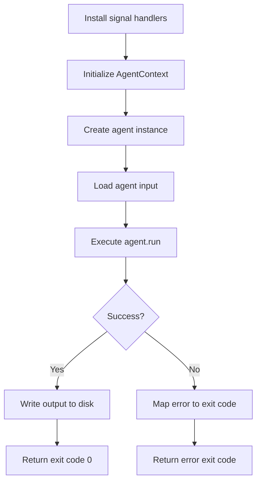

# Agents

## SageSanctumAgent

`SageSanctumAgent` is the abstract base class for all agents. Every agent must implement three members:

```python
from sage_sanctum import SageSanctumAgent, AgentResult
from sage_sanctum.io.inputs import AgentInput


class MyAgent(SageSanctumAgent):
    @property
    def name(self) -> str:
        return "my-agent"

    @property
    def version(self) -> str:
        return "1.0.0"

    async def run(self, agent_input: AgentInput) -> AgentResult:
        # Your agent logic here
        ...
```

| Member | Type | Description |
|--------|------|-------------|
| `name` | `property` | Agent identifier (used in SARIF output) |
| `version` | `property` | Semantic version string |
| `run` | `async method` | Main execution — receives input, returns result |

The agent receives an `AgentContext` via `self.context`, which provides access to LLM clients, model selection, the gateway, and output writing.

## AgentResult

The `run` method returns an `AgentResult`:

```python
@dataclass
class AgentResult:
    output: AgentOutput | None = None  # SARIF or other output
    exit_code: int = 0                 # Process exit code
    error: str = ""                    # Error message
    duration_seconds: float = 0.0      # Execution time
    metadata: dict[str, Any] = {}      # Additional metadata
```

## AgentRunner

`AgentRunner` handles the full agent lifecycle so you don't have to:

```python
if __name__ == "__main__":
    import sys
    sys.exit(AgentRunner(MyAgent).run())
```

### Lifecycle



1. **Signal handlers** — SIGTERM and SIGINT trigger graceful shutdown
2. **Context initialization** — `AgentContext.from_environment()` reads all config from environment variables
3. **Agent creation** — Your agent class is instantiated with the context
4. **Input loading** — `context.load_input()` reads the repository input
5. **Execution** — Your `run` method is called
6. **Output** — If the result contains output, it's written to the output directory
7. **Exit code** — `SageSanctumError` subclasses map to specific exit codes (see [Error Handling](../guides/error-handling.md))

### Error Mapping

If `run` raises a `SageSanctumError`, the runner maps it to the error's `exit_code`. Any other exception maps to exit code `1`. This means the orchestrator can distinguish between authentication failures (10-19), authorization failures (20-29), gateway errors (30-39), and so on.
