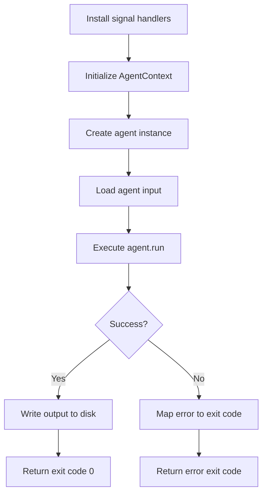

# Agents

## SageSanctumAgent

`SageSanctumAgent` is the abstract base class for all agents. It is generic on the input type. Every agent must implement three members:

```python
from sage_sanctum import SageSanctumAgent, AgentResult
from sage_sanctum.io.inputs import RepositoryInput


class MyAgent(SageSanctumAgent[RepositoryInput]):
    @property
    def name(self) -> str:
        return "my-agent"

    @property
    def version(self) -> str:
        return "1.0.0"

    async def run(self, agent_input: RepositoryInput) -> AgentResult:
        # agent_input.path is type-safe — no cast needed
        ...
```

| Member | Type | Description |
|--------|------|-------------|
| `name` | `property` | Agent identifier (used in SARIF output) |
| `version` | `property` | Semantic version string |
| `run` | `async method` | Main execution — receives input, returns result |

The agent receives an `AgentContext` via `self.context`, which provides access to LLM clients, model selection, the gateway, and output writing.

!!! tip "Generic input type"
    Specifying the type parameter (e.g., `SageSanctumAgent[RepositoryInput]`) gives you type-safe access to input fields in `run()` without needing `isinstance` checks. If omitted, the input type defaults to `AgentInput`.

## AgentResult

The `run` method returns an `AgentResult`:

```python
@dataclass
class AgentResult:
    output: AgentOutput | None = None  # SARIF or other output
    exit_code: int = 0                 # Process exit code
    error: str = ""                    # Error message
    duration_seconds: float = 0.0      # Execution time
    metadata: dict[str, Any] = {}      # Additional metadata
```

## AgentRunner

`AgentRunner` handles the full agent lifecycle so you don't have to:

```python
if __name__ == "__main__":
    import sys
    sys.exit(AgentRunner(MyAgent).run())
```

### Lifecycle



1. **Signal handlers** — SIGTERM and SIGINT trigger graceful shutdown
2. **Context initialization** — `AgentContext.from_environment()` reads all config from environment variables
3. **Agent creation** — Your agent class is instantiated with the context
4. **Input loading** — `context.load_input()` reads the repository input
5. **Execution** — Your `run` method is called
6. **Output** — If the result contains output, it's written to the output directory
7. **Exit code** — `SageSanctumError` subclasses map to specific exit codes (see [Error Handling](../guides/error-handling.md))

### Error Mapping

If `run` raises a `SageSanctumError`, the runner maps it to the error's `exit_code`. Any other exception maps to exit code `1`. This means the orchestrator can distinguish between authentication failures (10-19), authorization failures (20-29), gateway errors (30-39), and so on.

## External LLM Agents

Not all agents use the SDK's built-in LLM clients. Some wrap external tools like the [Claude Agent SDK](https://github.com/anthropics/claude-agent-sdk-python) or other CLI tools that manage their own LLM communication. For these agents, set `requires_gateway = False`:

```python
from sage_sanctum import SageSanctumAgent, AgentResult
from sage_sanctum.io.inputs import RepositoryInput


class ClaudeCodeAgent(SageSanctumAgent[RepositoryInput]):
    requires_gateway = False  # skip SPIFFE/TraT/gateway setup

    @property
    def name(self) -> str:
        return "claude-code-scanner"

    @property
    def version(self) -> str:
        return "0.1.0"

    async def run(self, agent_input: RepositoryInput) -> AgentResult:
        # self.context.gateway_client is None
        # self.context still provides load_input(), write_output(),
        # run_id, org_id, work_dir, output_dir
        ...
```

When `requires_gateway = False`:

- The runner uses `AgentContext.for_external_llm()` instead of `AgentContext.from_environment()`
- No SPIFFE JWT, Transaction Token, or gateway client is initialized
- `create_llm_client()` and `create_embeddings_client()` will raise `ConfigurationError` if called
- `check_gateway_health()` returns `False`
- Input loading and output writing work normally

### Graceful Shutdown

External agents often run long-lived subprocesses. The base class provides a shutdown event so agents can cooperatively cancel when SIGTERM is received:

```python
import asyncio
from sage_sanctum import SageSanctumAgent, AgentResult
from sage_sanctum.io.inputs import RepositoryInput


class MyExternalAgent(SageSanctumAgent[RepositoryInput]):
    requires_gateway = False

    # ... name, version ...

    async def run(self, agent_input: RepositoryInput) -> AgentResult:
        proc = await asyncio.create_subprocess_exec(
            "my-tool", str(agent_input.path),
        )

        # Race subprocess against shutdown signal
        proc_wait = asyncio.create_task(proc.wait())
        shutdown_wait = asyncio.create_task(self.wait_for_shutdown())

        done, pending = await asyncio.wait(
            {proc_wait, shutdown_wait},
            return_when=asyncio.FIRST_COMPLETED,
        )
        for task in pending:
            task.cancel()

        if shutdown_wait in done:
            proc.terminate()
            await proc.wait()
            return AgentResult(exit_code=130)

        # Process completed normally
        ...
```

| Member | Description |
|--------|-------------|
| `shutdown_requested` | `bool` property -- `True` after SIGTERM/SIGINT |
| `wait_for_shutdown()` | Coroutine -- blocks until shutdown is signaled |
