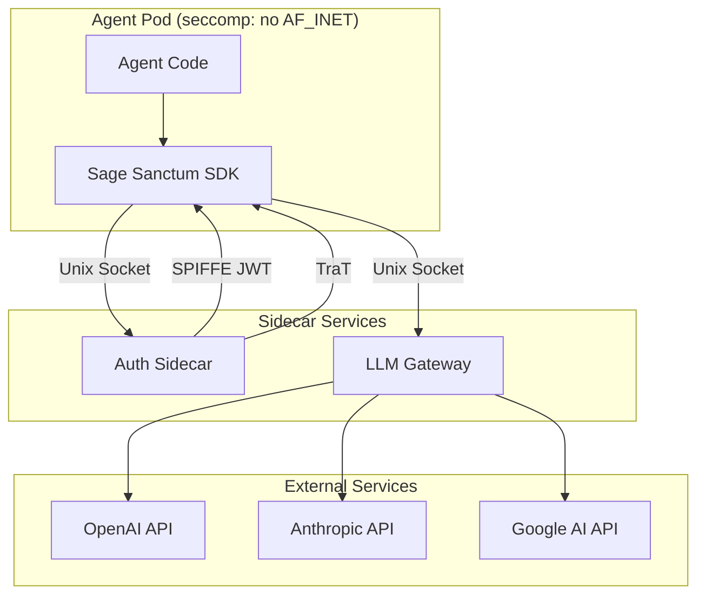
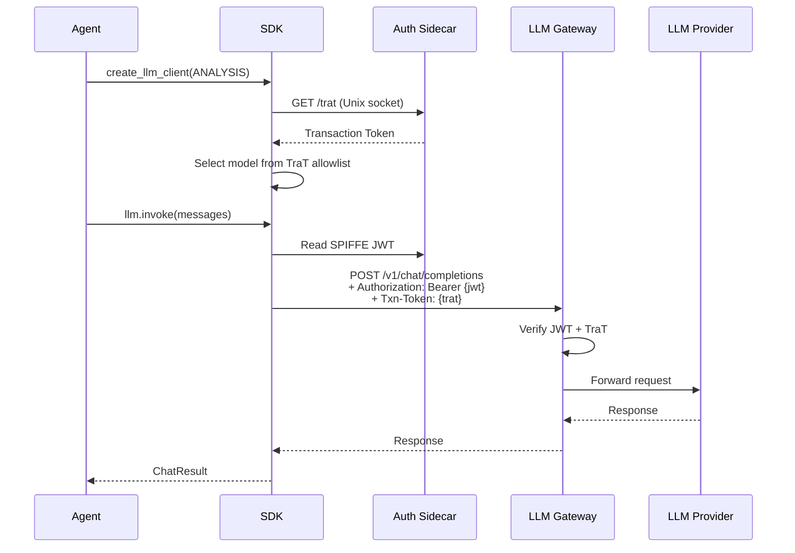

# Architecture

Sage Sanctum runs agents in hardened, isolated containers with no direct network access. The SDK mediates all external communication through authenticated gateways.

## Security Model



### Network Isolation

Agent pods run with a seccomp profile that blocks `AF_INET` socket creation. Agents **cannot** make direct network calls. All communication flows through Unix domain sockets to sidecar services.

### Identity: SPIFFE

Each agent receives a [SPIFFE](https://spiffe.io/) JWT SVID (Service Verification Identity Document) that proves its identity. The JWT is mounted into the container and automatically refreshed.

### Authorization: Transaction Tokens (TraT)

[Transaction Tokens](https://datatracker.ietf.org/doc/draft-ietf-oauth-transaction-tokens/) (IETF draft) carry the complete authorization context for a run:

- Which models the agent may use (per category)
- Which providers are allowed
- Which MCP tools are permitted
- Audit metadata (trigger, actor, PR number)

### Gateway

The LLM Gateway validates credentials, enforces policies, and proxies requests to LLM providers. It:

1. Verifies the SPIFFE JWT signature
2. Validates the TraT claims and expiry
3. Checks the requested model against the allowlist
4. Forwards the request to the provider
5. Returns the response to the agent

## Data Flow



## Three Modes of Operation

### Gateway Mode (Production)

In production, agents use SPIFFE + TraT via Unix sockets. This is the default when `SPIFFE_JWT_PATH` and related environment variables are set.

### Direct Mode (Local Development)

For local development, set `SAGE_SANCTUM_ALLOW_DIRECT=1` to bypass the gateway and call LLM providers directly with API keys from environment variables. See the [Configuration](../guides/configuration.md) guide.

!!! warning
    Direct mode disables all gateway security checks. Never use it in production.

### External LLM Mode

For agents that wrap external tools (like Claude Code) which manage their own LLM communication. The SDK handles only I/O and lifecycle; the external tool talks to the gateway independently (e.g., via a socat TCP-to-UDS bridge).

```
Agent Pod
├── Python Agent (SageSanctumAgent, requires_gateway=False)
│   └── External tool (e.g., claude CLI via Agent SDK)
│       └── ANTHROPIC_BASE_URL=http://127.0.0.1:8082
├── socat bridge (TCP:8082 → UDS:/run/gateway.sock)
└── LLM Gateway sidecar (credential injection, routing)
```

See the [Claude Code Integration](../guides/claude-code.md) guide for a full walkthrough.
