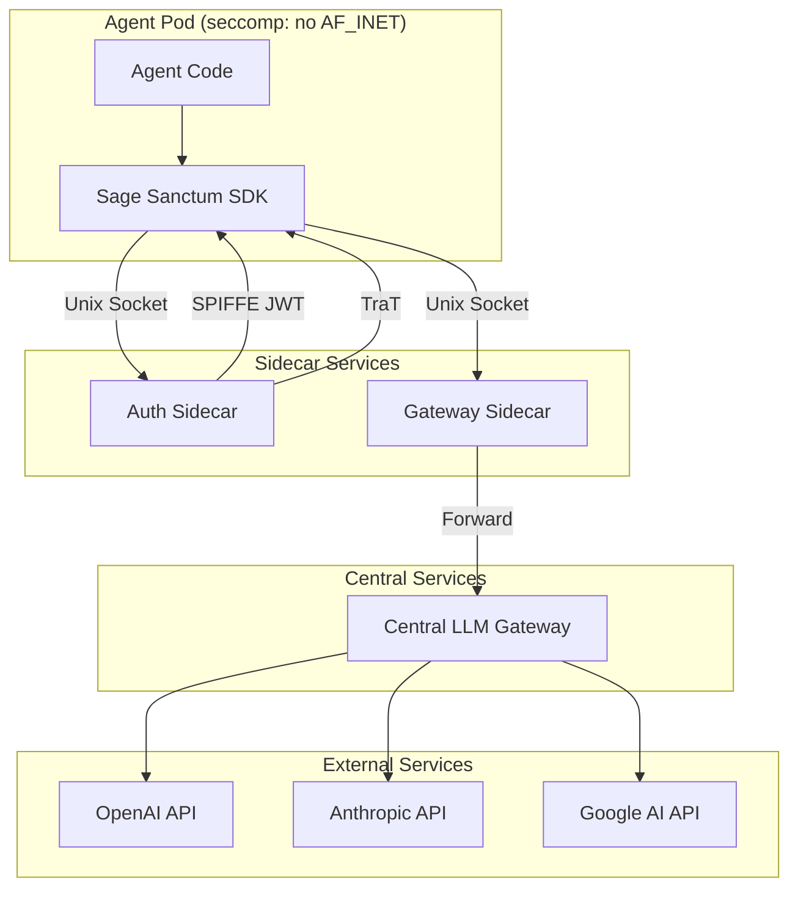
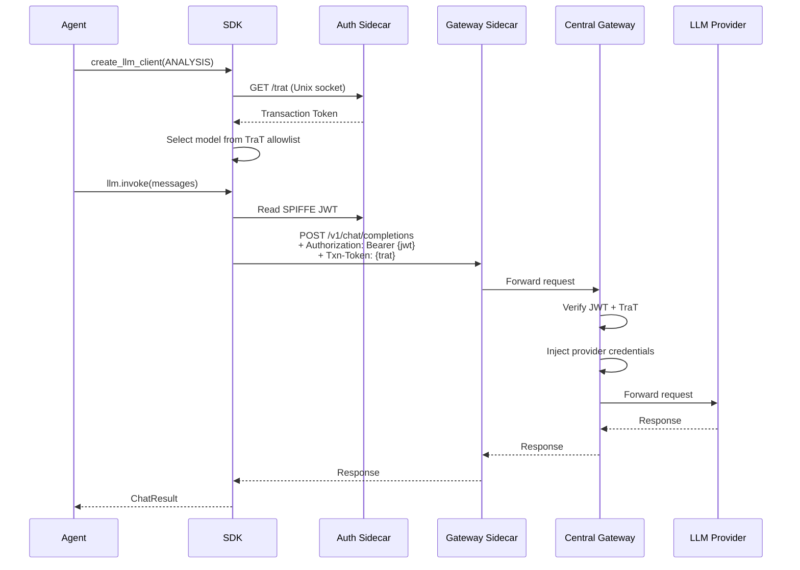

# Architecture

Sage Sanctum runs agents in hardened, isolated containers with no direct network access. The SDK mediates all external communication through authenticated gateways.

## Security Model



### Network Isolation

Agent pods run with a seccomp profile that blocks `AF_INET` socket creation. Agents **cannot** make direct network calls. All communication flows through Unix domain sockets to sidecar services, which forward to the central gateway.

### Identity: SPIFFE

Each agent receives a [SPIFFE](https://spiffe.io/) JWT SVID (Service Verification Identity Document) that proves its identity. The JWT is mounted into the container and automatically refreshed.

### Authorization: Transaction Tokens (TraT)

[Transaction Tokens](https://datatracker.ietf.org/doc/draft-ietf-oauth-transaction-tokens/) (IETF draft) carry the complete authorization context for a run:

- Which models the agent may use (per category)
- Which providers are allowed
- Which MCP tools are permitted
- Audit metadata (trigger, actor, PR number)

### Gateway

The gateway sidecar in the pod is a thin forwarder that accepts requests over a Unix domain socket and passes them to the central LLM gateway. The central gateway validates credentials, enforces policies, and proxies requests to LLM providers. It:

1. Verifies the SPIFFE JWT signature
2. Validates the TraT claims and expiry
3. Checks the requested model against the allowlist
4. Injects provider credentials (API keys)
5. Forwards the request to the provider
6. Returns the response to the agent

## Data Flow



## Three Modes of Operation

### Gateway Mode (Production)

In production, agents use SPIFFE + TraT via Unix sockets. This is the default when `SPIFFE_JWT_PATH` and related environment variables are set.

### Direct Mode (Local Development)

For local development, set `SAGE_SANCTUM_ALLOW_DIRECT=1` to bypass the gateway and call LLM providers directly with API keys from environment variables. See the [Configuration](../guides/configuration.md) guide.

!!! warning
    Direct mode disables all gateway security checks. Never use it in production.

### External LLM Mode

For agents that wrap external tools (like Claude Code) which manage their own LLM communication. The SDK handles only I/O and lifecycle; the external tool talks to the gateway independently via an auth-injecting bridge.

```
Scanner Pod
├── Python Agent (SageSanctumAgent, requires_gateway=False)
│   └── Claude Agent SDK (async subprocess)
│       └── ANTHROPIC_BASE_URL=http://127.0.0.1:8082
├── bridge.py (auth-injecting HTTP proxy: reads JWT + TraT, injects headers)
│   └── Forwards to UDS: /run/sage/llm.sock
├── LLM Gateway sidecar (forwarder mode, zero-logic)
│   └── Forwards to central gateway
└── Central LLM Gateway (validates auth, DLP, BYOK key injection)
```

See the [Claude Code Integration](../guides/claude-code.md) guide for a full walkthrough.
