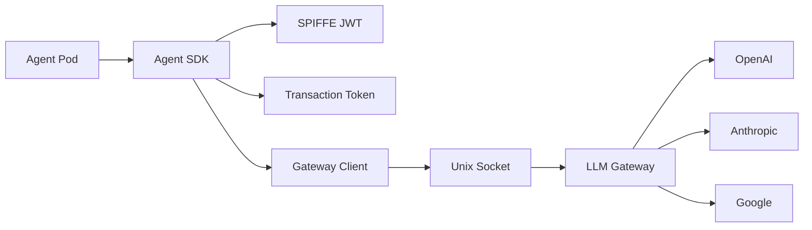

# Sage Sanctum Agent SDK

SDK for building agents that run within the [Sage Sanctum](https://sagesecurity.ai) secure multi-agent execution platform.

## Features

- **SPIFFE Authentication** — Automatic JWT SVID management for agent identity
- **Transaction Tokens (TraT)** — IETF-standard authorization for scoped transactions
- **LLM Gateway Integration** — Route LLM calls through authenticated, policy-enforced gateways
- **Multi-Provider Support** — OpenAI, Anthropic, and Google via unified interface
- **SARIF Output** — Standard static analysis output format for GitHub Code Scanning
- **Testing Utilities** — Mock gateway, LLM, and TraT clients for unit testing

## Quick Example

```python
from sage_sanctum import AgentContext, AgentRunner, SageSanctumAgent, AgentResult
from sage_sanctum.io.inputs import AgentInput, RepositoryInput
from sage_sanctum.io.outputs import SarifOutput, Finding, Location
from sage_sanctum.llm.model_category import ModelCategory


class MySecurityAgent(SageSanctumAgent):
    @property
    def name(self) -> str:
        return "my-security-agent"

    @property
    def version(self) -> str:
        return "0.1.0"

    async def run(self, agent_input: AgentInput) -> AgentResult:
        llm = self.context.create_llm_client(ModelCategory.ANALYSIS)
        response = llm.invoke([...])

        return AgentResult(
            output=SarifOutput(
                tool_name=self.name,
                tool_version=self.version,
                findings=[...],
            ),
            exit_code=0,
        )


if __name__ == "__main__":
    import sys
    sys.exit(AgentRunner(MySecurityAgent).run())
```

## Installation

```bash
pip install sage-sanctum-sdk
```

## Architecture Overview

Agents run in isolated containers with no direct network access. All external communication flows through authenticated gateways:



## Next Steps

- [Installation](getting-started/installation.md) — Set up the SDK in your project
- [Quickstart](getting-started/quickstart.md) — Build your first agent step by step
- [Architecture](concepts/architecture.md) — Understand the security model
- [API Reference](api/index.md) — Full API documentation
